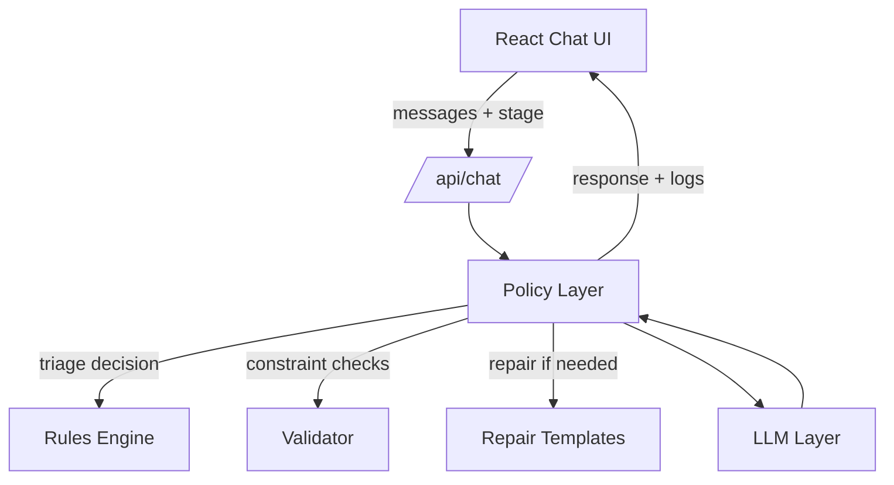

# System Design

## Overview
This prototype is a policy-guided AI consultation system with a deterministic policy layer and an LLM generation layer. The policy layer enforces safety and linguistic constraints, performs triage, and repairs any invalid LLM output. The LLM layer produces natural language responses within those constraints.

## Architecture


## Flow
```mermaid
flowchart TD
  A[Greeting + Safety + Consent] --> B[Timeline Question]
  B --> C[Clarify + Red Flag Screening]
  C --> D[Ask "What concerns you most about this?"]
  D --> E{Triage Decision}
  E -->|Emergency or Unclear| F[Emergency Escalation Template]
  E -->|Mild| G[3 Self-Care Recs]
  F --> H[Close with Check-in]
  G --> H
```

## Policy Layer
The policy layer is deterministic and controls:
- Stage transitions: greeting -> clarify -> concern -> recommendation
- Triage rules evaluation
- Response validation and repair

## Triage Rules (Minimum Viable)
Emergency if any of:
- Chest pain/pressure/tightness with shortness of breath OR sweating OR fainting
- Difficulty breathing, blue lips, severe wheezing
- New confusion, trouble speaking, one-sided weakness
- Severe allergic reaction signs (swelling of face or tongue, trouble breathing)
- Severe bleeding, passing out, seizure
- "Worst headache of life" with neck stiffness
- Severe or rapidly worsening symptoms

High risk flags:
- Pregnant
- Very young infant
- Immunocompromised

Triage output:
- Emergency if red flags or severe/rapidly worsening symptoms
- Unclear if high risk without severe signals
- Mild otherwise

## Validator
The validator enforces hard constraints:
- Exact phrases and ordering
- No banned phrases ("I see", "I hear", "don't worry")
- No medical jargon
- Mild: exactly 3 numbered recommendations (1-3), each ending with "How does this sound to you?"
- Emergency: must start with "Based on what you've told me..." and include "Here's what I recommend..."
- Escalations must include "This is beyond what I can safely assess remotely"
- Must include the in-person examination disclaimer and the follow-up timeframe sentence

## Repair Strategy
If validation fails, a deterministic repair template is applied based on stage and triage decision. This guarantees all constraints are met.

## Mock LLM Mode
Set `LLM_MODE=mock` to bypass external calls. The mock layer uses deterministic templates to produce compliant responses for local demos.

## Frontend UX
- Single-page chat UI with scenario presets
- Persistent safety notice
- Escalation banner + CTA when emergency is detected
- Collapsible log panel showing triage and validation results
